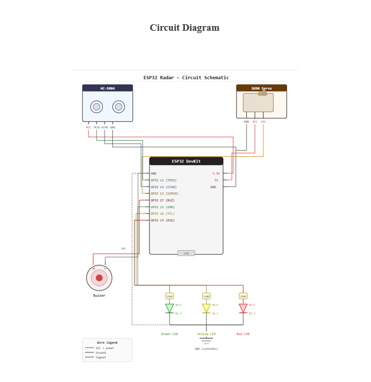
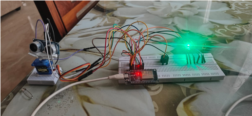
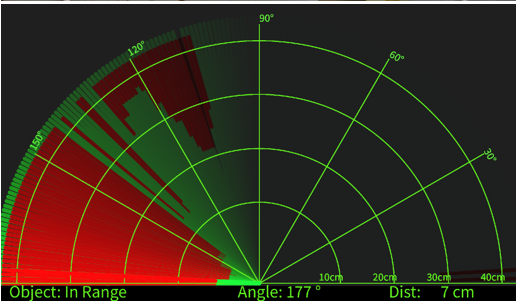
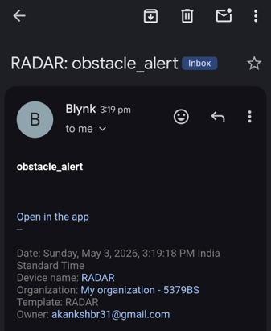

# IoT Obstacle Detection and Radar System

An IoT-based obstacle detection and radar monitoring system developed using **ESP32**, **HC-SR04 Ultrasonic Sensor**, **Servo Motor**, **Blynk IoT**, **LEDs**, and a **Buzzer**. The system scans the surroundings, detects obstacles, displays them on a radar interface, and sends notifications through the Blynk IoT platform.

---

## Project Overview

This project combines embedded systems, IoT, and data visualization to create a real-time obstacle detection system. The ultrasonic sensor is mounted on a servo motor, allowing it to scan a wide area. The detected obstacle information is transmitted to a Processing application, which displays a radar-like visualization. The ESP32 also communicates with the Blynk IoT platform to send alerts whenever an obstacle is detected within a predefined range.

---

## Features

- Real-time obstacle detection using HC-SR04
- 180° radar scanning using a servo motor
- Radar visualization using Processing
- Blynk IoT notifications
- LED indicators for obstacle status
- Buzzer alarm for nearby obstacles
- ESP32-based implementation

---

## Hardware Components

- ESP32 DevKit
- HC-SR04 Ultrasonic Sensor
- SG90 Servo Motor
- LEDs (Red, Yellow, Green)
- Buzzer
- Breadboard
- Jumper Wires
- USB Cable

---

## Software Used

- Arduino IDE
- Processing IDE
- Blynk IoT
- GitHub

---

## Project Structure

```
IoT-Obstacle-Detection-and-Radar-System
│
├── Arduino_Code/
│   └── radar.ino
│
├── Processing_Code/
│   ├── radar_display.pde
│   └── README.md
│
├── Images/
│   ├── hardware_setup.png
│   ├── radar_visualization.png
│   └── blynk_notification.png
│
├── Circuit_Diagram/
│   └── esp32_radar_circuit_diagram.png
│
├── Report/
│   ├── report.docx
│   └── README.md
│
└── README.md
```

---

## Circuit Diagram



---

## Hardware Setup



---

## Radar Visualization



---

## Blynk Notification



---

## How It Works

1. The servo motor rotates the ultrasonic sensor from 0° to 180°.
2. The HC-SR04 measures the distance to nearby objects.
3. ESP32 processes the measured distance.
4. LEDs and buzzer indicate obstacle status.
5. Distance and angle data are sent to the Processing application.
6. Processing displays a real-time radar visualization.
7. Blynk IoT sends notifications when an obstacle is detected.

---

## Applications

- Obstacle detection systems
- Robotics
- Smart surveillance
- Autonomous vehicles
- Industrial monitoring

---

## Future Improvements

- 360° radar scanning
- Mobile application integration
- Camera-based obstacle detection
- AI-based object classification
- Cloud data logging

---

## Team

Developed as an Embedded Systems and IoT project.

---

## License

This project is intended for educational purposes.
